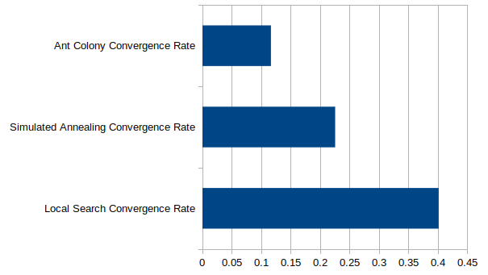
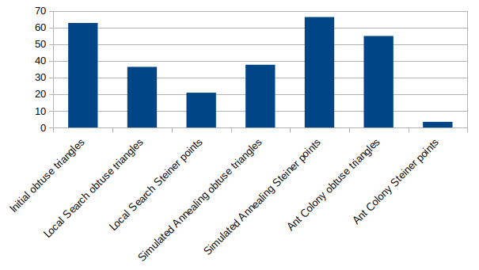
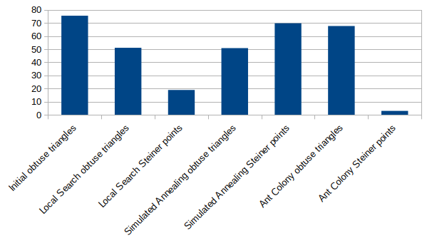
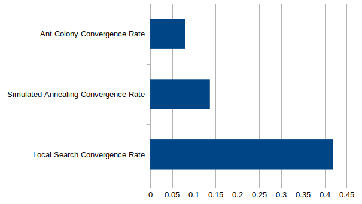
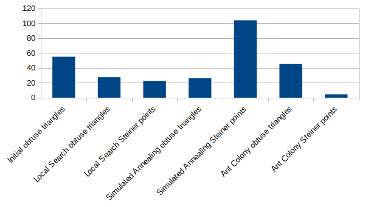
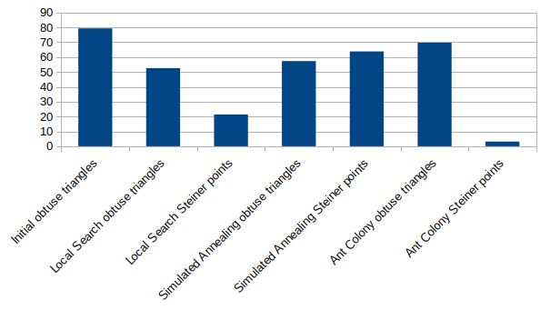
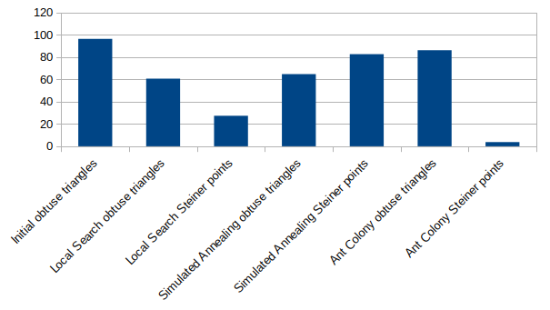

# Εργασία 3 

**Κοτσομπόλης Αθανάσιος 1115201900090**\
**Μεϊντάνης Σωτήριος 1115201900234**

## Οδηγίες εκτέλεσης

Για την μεταγλώττιση και την εκτέλεση του προγράμματος:\
```bash
mkdir build
cd build
cmake ..
make
./opt_triangulation -i ../data/<file_input> -o ../data/<file_output> 
```

Για τις δοκιμές και την εκτέλεση για τις λύσεις του διαγωνισμού χρησιμοποιήσαμε τα bash scripts **run_tests.sh** και **final_script.sh** μέσα από τον κατάλογο build όμως, οπότε αν θέλετε να τα τρέξετε μεταφέρετε τα πρώτα εκεί

Για το αρχείο CMakeLists.txt θα πρέπει να αλλάξετε την γραμμή `set(CGAL_DIR "/usr/local/lib/cmake/CGAL")` ώστε να περιλαμβάνει την τοποθεσία της CGAL στον υπολογιστή σας.

## Περιγραφή υλοποίησης

Η εργασία έχει την εξής δομή:

### data/
Έχει όλα τα instances του διαγωνισμού

### results/
Tις λύσεις για τα instances τις αποθυκεύσαμε ξεχωριστά εδώ

### include/
Περιέχει όλα τα αρχεία επικεφαλίδας που είναι απαραίτητα για την εφαρμογή. Συγκεκριμένα τα αρχεία:
- `jsonUtils.hpp` : Περιέχει τα πρότυπα των απαιτούμενων βοηθητικών συναρτήσεων για την διαχείριση των αρχείων json. Ως βοηθητική βιβλιοθήκη χρησιμοποιήσαμε την **nlohmann**
- `triangulation.hpp` : Περιέχει όλους τους αφηρημένους τύπους για την υλοποίηση της εφαρμογής
- `triangulationUtils.hpp` : Περιέχει τα πρότυπα των απαιτούμενων βοηθητικών συναρτήσεων για την τριγωνοποίηση
- `triangulationMethod.hpp` : Περιέχει την αφηρημένη κλάση που αναφέρεται σε κάποια υλοποίηση για την ελαχιστοποίηση των steiner points. Η αρχιτεκτονική που ακολουθήσαμε στηρίζεται στο strategy pattern κατά το οποίο η κλάση **TriangulationMethod** ορίζεται ως η κοινή διεπαφή προς γενικευμένη χρήση στον κύριο κώδικα καθώς και οι επιμέρους κλάσεις με το αντίστοιχο implementation που ορίζονται παρακάτω.
- `circumCenterMethod.hpp` : Περιέχει την implementation κλάση που υλοποιεί την μέθοδο circumCenterMethod
- `midpointMethod.hpp` : Περιέχει την implementation κλάση που υλοποιεί την μέθοδο midpointMethod
- `centroidMethod.hpp` : Περιέχει την implementation κλάση που υλοποιεί την μέθοδο CentroidMethod
- `projectionMethod.hpp` : Περιέχει την implementation κλάση που υλοποιεί την μέθοδο Projection
- `oneCentroidMethod.hpp` : Περιέχει την implementation κλάση που υλοποιεί την μέθοδο oneCentroidMethod

### src/
Περιέχει τις υλοποιήσεις των παραπάνω αρχείων, ακριβώς όπως στην εργασία 2.

##

# Έρευνα 

Για τις δοκιμές σε κάθε μέθοδο βάλαμε χρονικό όριο 60 δευτερόλεπτα, ώστε να γίνεται timeout σε περίπτωση που ο αλγοριθμός κρατάει πάνω από 1 λεπτό.

Για όλους τις μεθόδους χρησιμοποιούμε τις παραμέτρους (a,b,xi,psi,etc) της εργασίας 2, καθώς και εδώ είδαμε παρόμοια συμπεριφορά με τις δοκιμές στις παραμέτρους

Στα αρχεία csv είναι τα αποτελέσματα της μελέτης. Είναι 5 αρχεία, ένα για κάθε κατηγοριά και όλα τα instances τα έχουμε τρέξει και με τους 3 αλγορίθμους ( με το script run_tests.sh )

Για την τυχαιότητα δοκιμάσαμε αρκετά πράγματα ( να μπαίνει ένα τυχαίο σημείο σε τυχαίο αμβλυγώνιο όταν δεν υπάρχει βελτίωση με τις 5 μεθόδους εισαγωγής και να δούμε αν βελτιώνεται ή να μπαίνουν 5 τυχαία σημεία και κάπιους άλλους παρόμοιους τρόπος ) αλλά δεν είδαμε να υπάρχει βελτίωση σε σχεδόν κανένα παράδειγμα, παρά μόνο αύξυση των steiner points χωρίς καμία μείωση των αμβλυγωνίων ( και σε αρκετές περιπτώσεις μάλιστα αυξάνονταν και τα αμβλυγώνια ), οπότε έχουμε κάνει comment out τον κώδικα για την τυχαιοποίηση.

Για την κατηγορία "**Α. Κυρτό boundary (που ταυτίζεται με το Κυρτό Περίβλημα ) χωρίς περιορισμούς.**" τον καλύτερο ρυθμό σύγκλισης έχει η Local Search, που φαίνεται λογικό, αφού μιας και δεν υπάρχουν περιορισμοί, η Local Search βρίσκει σε κάθε βήμα την καλύτερη επιλογή για την μείωση των αμβλυγωνίων, οπότε θα καταφέρει να τα μειώσει αρκετά χωρίς επιπλέον steiner points, κάτι που κάνει ακριβώς η SA λόγω της τυχαιότητας και του βήματος της ενέργειας του αλγορίθμου. Γενικότερα ο αλγόριθμος Simulated Annealing ακόμα και στα μικρά instances προσθέτει αρκετά steiner points, που πολλές φορές σχεδόν μηδενίζουν τα αμβλυργώνια. Αλλά αυτό οδηγεί στην αργή εκτέλεση για τα μεγάλα instances καθώς έχουν προσθεθεί ακόμα και 100+ steiner points, κάνοντας έτσι τεράστιο τον γράφο, και την διάσχιση του σε κάθε βήμα να απαιτεί όλο και περισσότερο χρόνο. Σίγουρα με περισσότερους πόρους,υπολογιστική δύναμη και περισσότερη ώρα εκτέλεσης τα αμβλυγώνια θα ήταν λιγότερα από τον αλγόριθμο Local Search, αλλά θεωρήσαμε ότι είναι πιο σωστό να αφήσουμε το timeout στο 1 λεπτό, καθώς αυτό είναι και το νόημα του ρυθμού σύγκλισης.






Για την κατηγρία "**Β. Κυρτό boundary με «ανοιχτούς» περιορισμούς.**" έχουμε παρόμοια αποτελέσματα με την κατηγορία Α' αλλά με την διαφορά ότι στα μικρά έως μεσαία instances ο αλγόριθμος Simulated Annealing έχει αρκετά καλύτερα αποτελέσματα αν κρίνουμε από τον την μείωση του αριθμού των αμβλυγωνίων σε σχέση με τον αρχική τριγωνοποίηση. Και εδώ όμως παρατηρούμε το ίδιο φαινόμενο, ότι για μεγάλα instances, "αργεί" o αλγόριθμος SA. Οπότε αποφασίσαμε μετά από κάποιες extra δοκιμές για την κατηγορία αυτή να χρησιμοποιούμε τον SA αλλά δίνοντας του λίγο περισσότερο χρόνο ώστε να συγκλίνει.




Για την κατηγορία "**Γ. Κυρτό boundary με περιορισμούς που αποτελούν ακμές πολυγώνων που σχηματίζονται
εντός του boundary, συμπεριλαμβανομένων των ακμών που βρίσκονται επί του boundary
(«κλειστοί περιορισμοί»).**" να πούμε αρχικά ότι θεωρήσαμε κλειστούς περιοσμούς μόνο αυτούς που δημιουργούν εξολοκλήρου έναν "κύκλο", δηλαδή έναν μεγάλο κλειστό περιορισμό. Το δείγμα εδώ βέβαια είναι μικρό καθώς προέκυψαν μόνο 2 τέτοια instances, αλλά φαίνεται ότι η Local Search είναι ξανά η καλύτερη επιλογή

 




Για την κατηγορία "**Δ. Μη κυρτό boundary με ευθύγραμμα τμήματα παράλληλα στους άξονες χωρίς
περιορισμούς**" είδαμε ότι η καλύτερη μέθοδος ήταν η Local Search, κάτι που επιβεβαιώνεται βλέποντας τα αποτελέσμτα στα μεγάλα instances όπου καταλήγει σε τριγωνοποίηση με λιγότερα αμβλυγώνια από την SA, αλλά και με αρκετά μικρότερο αριθμό από steiner points 





Για την κατηγορία "**Ε. Μη κυρτό boundary, ακανόνιστο, που δεν εντάσσεται στις κατηγορίες Α-Δ**" τα αποτελέσματα ήταν παρόμοια με την Δ, που είναι λογικό καθώς είναι αρκετά παρόμοιες κατηγορίες. Και εδώ παρατηρείται το ίδιο φαινόμενο. Για τα πιο μικρά instances η SA έχει τα λιγότερα αμβλυγώνια αλλά με πολλά steiner points, αλλά όσο μεγαλώνουν τα instances η Local Search έχει τα λιγότερα αμβλυγώνια και με αρκετά λιγότερα steiner points


